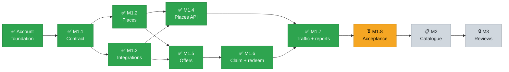
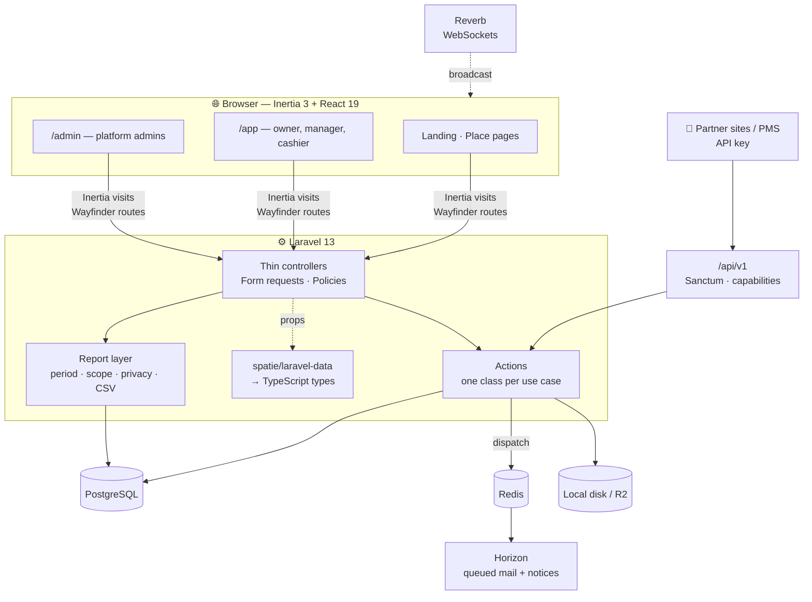
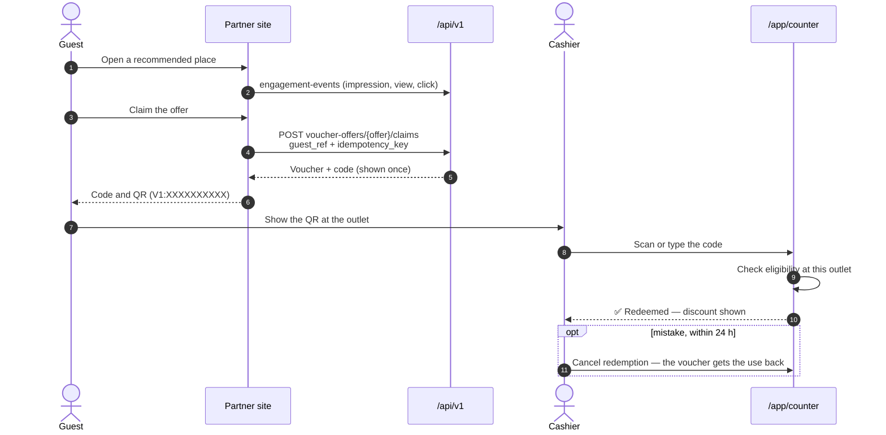

<div align="center">


# AroundThat

**Your offers, on every concierge screen nearby.**<br/>
Hotels and travel partners recommend nearby places to their guests. AroundThat puts a business and its voucher offers on that list, redeems the vouchers at the counter, and shows which recommendations led to visits.


[Features](#-features) ·
[Roadmap](#%EF%B8%8F-roadmap) ·
[Why Laravel](#-why-laravel) ·
[Architecture](#%EF%B8%8F-architecture) ·
[Development](#-development) ·
[Privacy](#-privacy) ·
[Docs](#-docs)

</div>

---

## ✨ Features

<table>
<tr>
<td width="50%" valign="top">

### 🏪 Businesses and outlets

- Owners onboard a business, submit it for review and run one or more outlets
- Public place page per outlet: listing, tags, opening hours, special dates, cover and gallery photos
- Preview the public page before it goes live
- Content edits are logged with restore snapshots so admins can review or revert them

</td>
<td width="50%" valign="top">

### 🎟️ Voucher offers

- Percentage, amount or free-item offers — draft, active or paused
- Choose exactly which outlets accept an offer, including **sponsored** outlets of another business
- Start and end dates, voucher validity, uses per voucher and an optional issue limit
- Partners claim vouchers for their guests through the API
- Codes are 10 characters from Crockford's alphabet — easy to read aloud, no I/L/O/U mix-ups

</td>
</tr>
<tr>
<td valign="top">

### 📱 Counter

- Phone-width, full-screen counter for cashiers
- Scan the voucher QR with the camera, or type the code
- Each redemption uses one of the voucher's uses; a double tap or retry returns the **first** redemption
- A mistaken redemption can be cancelled within 24 hours — the row stays, marked cancelled

</td>
<td valign="top">

### 📊 Reports and dashboard

- Vouchers used, offer performance and place visits — by day, week, month, outlet or offer
- Bar chart above every report, CSV download
- Dashboard: this month's numbers, quick actions, needs attention, latest vouchers used
- Cashiers see the counter, not the numbers

</td>
</tr>
<tr>
<td valign="top">

### 🔌 Partner API

- Versioned `/api/v1`, Sanctum API keys per integration
- Per-key capabilities: read places, send engagement events, read offers, claim vouchers
- Idempotent claims and event batches — a retry never counts twice
- OpenAPI docs generated by Scramble at `/docs/api` (admins only)

</td>
<td valign="top">

### 🛡️ Admin

- Review queue for businesses, outlets and offers, shown as a board
- Suspend, archive or hide any business, outlet, offer, user or integration — with a reason
- Change feed of owner edits with one-click revert
- Categories, reviewed tags and image storage (local or Cloudflare R2)

</td>
</tr>
</table>

---

## 🗺️ Roadmap

AroundThat ships in milestones. Each package delivers one usable slice: the web workflow, the API contract, authorization, audit records and focused tests.

```text
Milestone 1  ██████████████████░░░  7 / 8 packages done
```

|  #   | Package                  | Scope                                                                                                | Status                                                                               |
| :--: | :----------------------- | :--------------------------------------------------------------------------------------------------- | :----------------------------------------------------------------------------------- |
|  —   | **Account foundation**   | Businesses and outlets, memberships, invitations, workspaces, no public sign-up, temporary passwords |                  |
| M1.1 | **Contract**             | API contract: requests, errors, pagination, auth                                                     |                  |
| M1.2 | **Places**               | Owners manage place content; admins publish, reject or hide it; categories and host outlets          |                  |
| M1.3 | **Integration access**   | Integrations, capabilities, API keys shown once, rotate and revoke                                   |                  |
| M1.4 | **Published places API** | Permitted integrations list and read published places                                                |                  |
| M1.5 | **Voucher offers**       | Offers, eligible outlets, admin-approved sponsored outlets, offers API                               |                  |
| M1.6 | **Claim and redeem**     | Idempotent claims, read and void own vouchers, counter redemption and cancel                         |                  |
| M1.7 | **Traffic and reports**  | Engagement events, suspect events excluded, aggregate reports with privacy guard                     |                  |
| M1.8 | **Acceptance**           | Security, concurrency and audit checks, PMS contract test, ops docs, first deploy                    |                  |
|  M2  | **Featured catalogue**   | Catalogue items per outlet, featured items, `catalogue:read` API — no cart or payment                |         |
|  M3  | **Reviews and feedback** | Moderated reviews, private feedback, protected guest data                                            |  |



> [!NOTE]
> M3 needs management decisions first: review responses and moderation (OPEN2-7, OPEN2-8), and how long reviews and feedback are kept (OPEN2-9).

---

## 🧭 Why Laravel

AroundThat was first prototyped on Rails 8. Both versions use the same frontend — Inertia 3, React 19 — and PostgreSQL, so the choice was about the backend. Laravel's first-party packages cover what this app needs, so less of it is our own code to maintain.

| Need                       | Rails prototype                                                              | Laravel                                                                                         |
| :------------------------- | :--------------------------------------------------------------------------- | :---------------------------------------------------------------------------------------------- |
| Login, 2FA, password reset | `authentication-zero` — generated code the team owns and patches             | **Fortify** — maintained first-party package, TOTP 2FA included                                 |
| Partner API keys           | Custom `ApiCredential` model with HMAC lookup                                | **Sanctum** tokens, checked against per-integration capabilities                                |
| API reference              | Hand-written OpenAPI YAML, kept honest by a lint and a contract-check script | **Scramble** generates OpenAPI from the routes, form requests and resources — it can't drift    |
| Typed frontend             | `typelizer` serializer types and generated route helpers                     | **laravel-data** types and **Wayfinder** routes, regenerated by a watcher in `composer run dev` |
| Queues                     | Solid Queue, no dashboard                                                    | **Horizon** on Redis with a dashboard, metrics and retries                                      |
| Realtime                   | Solid Cable                                                                  | **Reverb**, with `@laravel/echo-react` hooks                                                    |
| Change history and revert  | Custom `AuditLog` model                                                      | **spatie/laravel-activitylog**, keeping old values for restore                                  |
| AI-assisted development    | General tooling                                                              | **Laravel Boost** MCP: version-matched docs, schema and log access for the coding agent         |

> [!NOTE]
> Rails was not the problem — both stacks can build AroundThat. Laravel meant fewer custom pieces to own, generated contracts instead of hand-kept ones, and one ecosystem for auth, queues, realtime and API docs.

---

## 🏗️ Architecture



| Layer    | Where                                        | Role                                                                                  |
| :------- | :------------------------------------------- | :------------------------------------------------------------------------------------ |
| Actions  | [`app/Actions`](app/Actions)                 | Every write — onboarding, review, redeem, claim, void. Controllers and API share them |
| Data     | [`app/Data`](app/Data)                       | Typed output for Inertia props and the API; generates `resources/js/types`            |
| Policies | [`app/Policies`](app/Policies)               | Role abilities per business, admin gates                                              |
| Reports  | [`app/Support/Reports`](app/Support/Reports) | Shared period, scope, filters, privacy guard and CSV for every report                 |
| Pages    | [`resources/js/pages`](resources/js/pages)   | `app/`, `admin/`, `places/`, `settings/`, `auth/`                                     |
| Routes   | [`routes/`](routes)                          | `web.php`, `app.php`, `admin.php`, `settings.php`, `api.php`                          |

> [!TIP]
> Controllers stay thin. A rule that matters — who can redeem, how many vouchers are left, what a report may show — lives in an Action or a Support class, and has a test.

### 🔄 Voucher flow



### 👥 Roles

| Ability                                            | Owner | Manager  | Cashier  |
| :------------------------------------------------- | :---: | :------: | :------: |
| Scan and redeem at the counter                     |  ✅   |    ✅    |    ✅    |
| See today's activity                               |  ✅   |    ✅    |    ✅    |
| View reports                                       |  ✅   |    ✅    |    —     |
| Manage offers                                      |  ✅   |    ✅    |    —     |
| Void vouchers                                      |  ✅   |    —     |    —     |
| Manage business, outlets, staff and public content |  ✅   |    —     |    —     |
| Covers every outlet                                |  ✅   | assigned | assigned |

Platform admins are separate: an `admin` flag on the user, with the whole `/admin` area.

---

## 🚀 Development

**Prerequisites:** PHP 8.4 · Composer 2 · Node 22 with pnpm · PostgreSQL · Redis.

```bash
# 1 — install, create .env, migrate and build
composer setup
```

```bash
# 2 — the test database, used by Pest
createdb db_aroundthat_testing
```

```bash
# 3 — all dev processes at once
composer run dev
```

`composer run dev` runs `php artisan dev`: the web server, Vite, Horizon, Reverb, `pail` logs and the TypeScript types watcher.

To get an admin account, set `ADMIN_SEED_EMAIL` and `ADMIN_SEED_PASSWORD` in `.env`, then:

```bash
php artisan db:seed
```

> [!IMPORTANT]
> Frontend changes not showing? Vite must be running (`composer run dev`), or run `pnpm run build`. After changing a Data class, the types watcher regenerates `resources/js/types`; commit the result.

### ✅ Checks

```bash
composer ci:check
```

That runs, in order: `vp check` (lint + format), `tsc --noEmit`, Pint, PHPStan (level 7) and the Pest suite. CI runs the same command against PostgreSQL 18.

```bash
php artisan test --compact --filter=Counter   # narrow while working
vendor/bin/pint --dirty --format agent        # format changed PHP
```

See [docs/development.md](docs/development.md) for conventions, the project layout and the frontend stack.

---

## 🔒 Privacy

AroundThat shows businesses **what** brought guests in, never **who** they are.

- A partner identifies a guest only by its own `guest_ref`, and a session only by `session_ref`. Both are stored as **one-way hashes**.
- Voucher codes are looked up by HMAC. The code itself is stored encrypted, only for an explicit, rate-limited reveal in the app.
- Reports about a **sponsored** outlet of another business hide any row with 1–4 redemptions. When only one row would be hidden, a second is hidden with it, so the total can't be used to subtract it back.
- Every admin action that changes someone else's data records a reason and the IP in the activity log.

> [!WARNING]
> `APP_KEY` also keys the voucher code HMAC. Rotating it makes every issued code unreadable at the counter.

---

## 📚 Docs

| Document                                                 | What's in it                                                 |
| :------------------------------------------------------- | :----------------------------------------------------------- |
| [docs/development.md](docs/development.md)               | Local setup, commands, conventions, project layout           |
| [docs/architecture.md](docs/architecture.md)             | Domain model, workspaces, roles, moderation, activity log    |
| [docs/vouchers.md](docs/vouchers.md)                     | Offers, codes, claiming, the counter, cancelling and voiding |
| [docs/reports.md](docs/reports.md)                       | The report layer, periods, scope, privacy guard, CSV         |
| [docs/partner-api.md](docs/partner-api.md)               | API keys, capabilities, endpoints, idempotency, errors       |
| [docs/deployment/coolify.md](docs/deployment/coolify.md) | Production deploy with Docker Compose on Coolify             |

---

<div align="center">
<sub>Built in Malaysia · Laravel 13 · Inertia 3 · React 19</sub>
</div>
