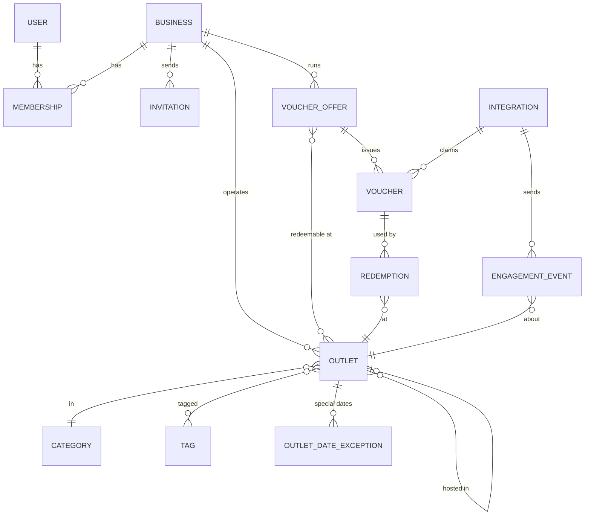
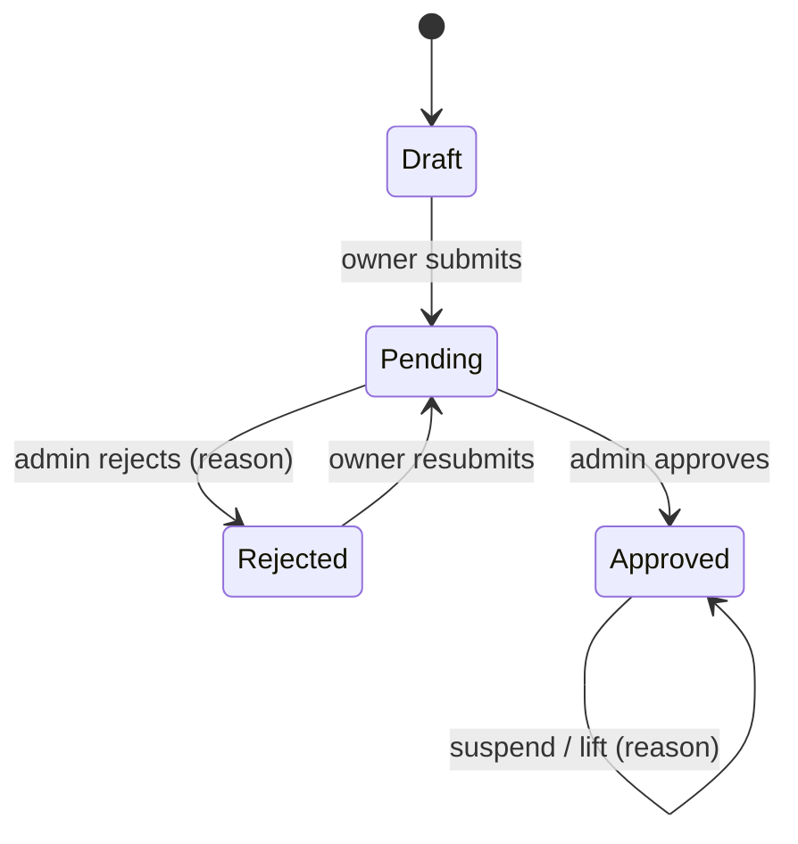

# Architecture

AroundThat has three audiences, each with its own area:

| Area        | URL                   | Who                                              |
| ----------- | --------------------- | ------------------------------------------------ |
| Public      | `/`, `/places/{slug}` | Visitors and guests                              |
| Workspace   | `/app`                | Business members: owners, managers, cashiers     |
| Admin       | `/admin`              | Platform admins                                  |
| Partner API | `/api/v1`             | Hotels, PMS and travel partners, with an API key |

Settings (`/settings`) are shared by every signed-in user.

## Domain model

| Model             | What it is                                                             |
| ----------------- | ---------------------------------------------------------------------- |
| `User`            | A person who signs in. UUID key. `is_admin` marks platform admins.     |
| `Business`        | The company that owns outlets and runs offers.                         |
| `Membership`      | A user's role in one business, and the outlets it covers.              |
| `Invitation`      | An emailed link to join a business. Valid for 14 days.                 |
| `Outlet`          | One physical place. Has a public page, opening hours, photos and tags. |
| `VoucherOffer`    | The terms of a discount and the outlets that accept it.                |
| `Voucher`         | One guest's copy of an offer, with its own code.                       |
| `Redemption`      | One use of a voucher at an outlet.                                     |
| `Integration`     | A partner with API keys and capabilities.                              |
| `EngagementEvent` | A partner-reported impression, page view or outbound click.            |
| `Activity`        | The change log (spatie/laravel-activitylog).                           |
| `Image`           | Logos, covers and gallery photos, on the local disk or R2.             |

## Workspaces

A user can belong to more than one business. The `business` middleware (`ResolveCurrentBusiness`) picks the business for each `/app` request:

1. The business saved in the session, if the user is still an active member.
2. Otherwise, the only active membership, if there is exactly one.
3. Otherwise, redirect to the workspace chooser — or to `/admin` for an admin with no memberships, or to the "no workspace" page.

`App\Support\Workspace` holds the resolved membership for the rest of the request. The business switcher sits in the header.

## Roles and abilities

Roles are defined in `App\Enums\MembershipRole` and checked through `App\Enums\Ability` in the policies.

| Ability               | Owner | Manager | Cashier |
| --------------------- | :---: | :-----: | :-----: |
| `Scan`                |  ✅   |   ✅    |   ✅    |
| `ViewTodayActivity`   |  ✅   |   ✅    |   ✅    |
| `ViewReports`         |  ✅   |   ✅    |    —    |
| `ManageOffers`        |  ✅   |   ✅    |    —    |
| `VoidVouchers`        |  ✅   |    —    |    —    |
| `ManageBusiness`      |  ✅   |    —    |    —    |
| `ManageOutlets`       |  ✅   |    —    |    —    |
| `ManageStaff`         |  ✅   |    —    |    —    |
| `ManagePublicContent` |  ✅   |    —    |    —    |

- Owners cover every outlet. Managers and cashiers cover only the outlets assigned to their membership.
- A business always keeps at least one active owner (`EnsureBusinessKeepsAnOwner`).
- Admins pass the `admin` gate: `is_admin` and not suspended. Admin screens use `business:optional`, so an admin who is also a member keeps their workspace.

## Accounts

- Authentication is Laravel Fortify: login, password reset, email verification and TOTP two-factor.
- There is no public sign-up. Users arrive by staff invitation, or an admin creates them when onboarding a business.
- An admin can give a user a **temporary password**. `EnsurePasswordIsChanged` sends that user to change it before anything else.
- A **suspended** user is signed out by `EnsureUserIsNotSuspended`.
- Changing a password signs the user out on every other device.
- Admins can help a locked-out user back in (`RecoverUserAccess`). Each step is logged, never the password.

## Moderation

Businesses and outlets share `HasOnboarding`:

- An admin can also onboard a business directly and approve it at once. The first owner joins by an existing account, a temporary password or an invitation.
- **Suspension** is separate from approval. A suspended business or outlet stops trading: no redemptions, not public.
- An outlet is **operational** when it and its business are approved and not suspended, and the outlet is not archived.
- An outlet is **public** when it is operational, listed by the owner, not hidden by an admin, and has the listing fields filled in (summary, category, location, ...).
- An admin can **hide** an outlet or an offer without suspending it. A hidden outlet still trades but visitors can't find it; a hidden offer can't be claimed or redeemed. The owner can't undo either.
- An admin can record that an outlet is **hosted in** another (a restaurant inside a mall). It gives the host no access.

Moderation results are emailed to the business by queued jobs (`NotifyPlaceModeration`, `NotifyOfferModeration`).

## Change feed

Owner edits to public content (business profile, outlet listing, hours, links, photos) are logged with the old values as a restore snapshot.

- `/admin/changes` lists them for review. Marking a change as reviewed keeps the first review.
- An admin can **revert** a change while its new values are still in place. A later edit to the same fields must be reverted first.
- The revert is logged as its own change with the admin's reason, and the owners are emailed.

## Activity log

Every model that matters uses `LogsActivity`. Each entry records the action name, the actor, and — for admin actions — the reason and IP address. Timelines appear on the business, outlet, offer, user and integration pages.

## Images

`App\Actions\Images\ManageImages` stores logos, covers and gallery photos. Admins choose the disk under **Settings → Image Configuration**: `local` or Cloudflare `r2`. Deleted images are pruned daily by the scheduler (`model:prune`).

## Queues and realtime

| Service         | Used for                                                       |
| --------------- | -------------------------------------------------------------- |
| Redis + Horizon | Invitation emails, moderation notices, owner notices           |
| Scheduler       | Daily image pruning                                            |
| Reverb          | WebSocket broadcasting to the signed-in user's private channel |

The `/horizon` dashboard is closed in production until users are added to the `viewHorizon` gate.
