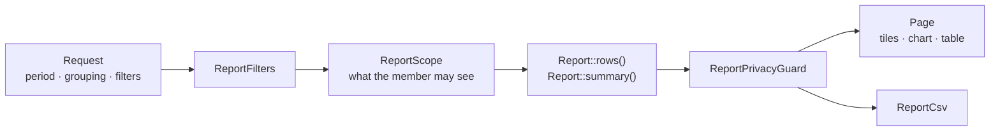

# Reports

Reports live under **Reports** in the `/app` sidebar. Owners and managers can see them (`ViewReports`).

## The reports

| Key            | Title         | Question                                                         | Group by                        | Filters       |
| -------------- | ------------- | ---------------------------------------------------------------- | ------------------------------- | ------------- |
| `redemptions`  | Vouchers used | How many vouchers were used, and how much discount did you give? | day, week, month, outlet, offer | offer, outlet |
| `offers`       | Offer results | Which offer works best?                                          | offer                           | outlet        |
| `place-visits` | Place visits  | How many people found your place on partner sites?               | day, week, month, outlet        | outlet        |

### Vouchers used

Columns: vouchers used, total bills, discount given, customers paid, cancelled.

Covers vouchers used at the member's outlets and, for owners, the business's own offers used at sponsored outlets of other businesses. Cancelled redemptions are left out of every total and only counted.

### Offer results

Columns: vouchers given out, from partner sites, vouchers used, discount given, left to give.

Lists every offer that ran in the period, even with nothing to show. Vouchers belong to the offer, not to an outlet, so the outlet filter narrows only "vouchers used".

### Place visits

Columns: shown in lists, page opened, links clicked, vouchers claimed, opened-then-claimed rate.

Built from the partners' engagement events and claims. Events that look like abuse are left out. Every outlet here is the business's own, so the privacy guard does not apply.

## The report layer

Every report implements `App\Support\Reports\Report` and is registered in `ReportRegistry`. The shared page, the CSV and the dashboard read every report through that interface.

| Class                        | Role                                                                                                   |
| ---------------------------- | ------------------------------------------------------------------------------------------------------ |
| `Report`                     | One question: `title`, `question`, `groupings`, `filters`, `columns`, `chartSeries`, `rows`, `summary` |
| `ReportRegistry`             | The list of reports, looked up by key                                                                  |
| `ReportFilters`              | The parsed period, grouping, and offer / outlet filter                                                 |
| `ReportPeriod`               | Whole days in the business's timezone, both ends included. At most 366 days                            |
| `ReportScope`                | The outlets and offers the member may see. Every report query starts here                              |
| `ReportPrivacyGuard`         | Hides small groups at other businesses' outlets                                                        |
| `ReportCsv`                  | The table as a CSV download                                                                            |
| `ReportColumn`, `ReportTile` | Column and summary tile definitions                                                                    |

### Periods

Presets: today, last 7 days, last 30 days, this month, last month, or a custom range. Days are counted in the **business's timezone**, not UTC.

### Scope

- **Owners** see every outlet of the business, plus their offers wherever they were used.
- **Managers** see their assigned outlets only.

No report can reach an outlet the member can't, or another business's data beyond the business's own offers.

### Privacy guard

An owner's offer can be used at a sponsored outlet of another business. The owner must not be able to read a single guest's visit there.

- A row about another business's outlet with 1–4 redemptions is hidden (`MINIMUM_GROUP_SIZE = 5`).
- If only one row would be hidden, the smallest other protected row is hidden with it. Otherwise the owner could subtract the visible rows from the total.
- If no second row exists, the summary total is hidden instead.
- The business's own outlets are always shown exactly.

Hidden values show as empty in the table and in the CSV.

## CSV

`GET /app/reports/{report}/export` downloads the current view: column labels, then one line per row with plain numbers. It is limited to 30 downloads a minute.

## Adding a report

1. Create a class in `app/Support/Reports/Types` that implements `Report`.
2. Start every query from `ReportScope`.
3. If any row can be about another business's outlet, pass the rows through `ReportPrivacyGuard`.
4. Add the class to `ReportRegistry::REPORTS`.
5. Add a feature test in `tests/Feature/App/ReportTest.php` for the scope and, where it applies, the privacy guard.
