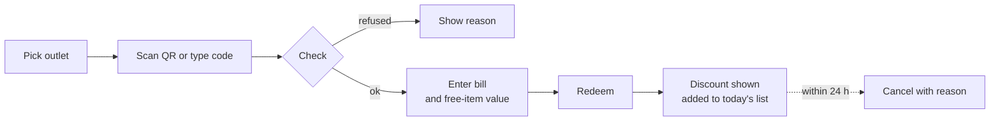

# Vouchers

## Offers

A `VoucherOffer` holds the terms. Owners and managers manage offers under **Offers** in `/app`.

| Field                  | Meaning                                                 |
| ---------------------- | ------------------------------------------------------- |
| `discount_type`        | `percentage`, `amount` or `free_item`                   |
| `discount_value`       | The percentage or the amount                            |
| `max_discount_amount`  | Cap on a percentage discount                            |
| `min_spend_amount`     | The bill must reach this                                |
| `free_item`            | What the guest gets, for `free_item` offers             |
| `starts_at`, `ends_at` | When the offer runs                                     |
| `voucher_valid_days`   | How long each voucher lasts after it is issued          |
| `uses_per_voucher`     | How many times one voucher can be redeemed              |
| `voucher_limit`        | Most vouchers the offer can issue. Empty means no limit |
| `status`               | `draft`, `active` or `paused`                           |

Once the first voucher is issued, guests hold those terms. After that, only `description`, `status`, `ends_at` and `voucher_limit` can change (`VoucherOffer::EDITABLE_AFTER_ISSUE`).

### Where an offer works

An offer lists the outlets that accept it:

- **Own outlets** — the owner picks them from the business's outlets.
- **Sponsored outlets** — an admin adds an outlet of _another_ business. Adding it is the approval: that outlet's cashiers can redeem at once. Both adding and removing are logged on the offer.

### Admin controls

An admin can **hide** an offer. A hidden offer can't be claimed or redeemed whatever its status, and the owner can't run it again until an admin restores it. Members who manage offers are emailed.

## Codes

`App\Support\Vouchers\VoucherCode`:

- 10 characters from Crockford's alphabet `0123456789ABCDEFGHJKMNPQRSTVWXYZ` — no I, L, O or U.
- Shown as `ABCDE-12345`.
- A QR code holds `V1:` followed by the code, so the scanner can tell it from other QR codes.
- The counter accepts either form. Spaces, dashes and lower case are normalized.

Storage:

| Column         | Holds                                                            |
| -------------- | ---------------------------------------------------------------- |
| code hash      | HMAC-SHA256 with a key derived from `APP_KEY`. Used for lookups. |
| code prefix    | The first 4 characters, to help staff find a voucher in a list.  |
| encrypted code | The code, encrypted, for a reveal.                               |

> [!WARNING]
> Rotating `APP_KEY` breaks every issued code: the hash no longer matches and the encrypted code can't be decrypted.

## Issuing

Vouchers come from two places:

1. **A partner claims one** for a guest through the API. See [partner-api.md](partner-api.md#claim-a-voucher).
2. **Staff issue one** from the offer's **Vouchers** tab (owners and managers).

`IssueVoucher` raises the offer's issued count in the same statement that checks `voucher_limit`, so two issues at once can never pass the limit. A voucher expires after `voucher_valid_days` or when the offer ends, whichever is first.

A new code is flashed to the page **once**. Owners and managers can reveal it again later; reveals are limited to 6 a minute.

## The counter

`/app/counter` is a phone-width, full-screen page for cashiers.

- The counter remembers the cashier's outlet. Only outlets the member covers are listed.
- A voucher of another business works here when this outlet is a sponsored outlet of the offer.
- `check`, `redeem` and `cancel` are limited to 60 requests a minute per user.

### Checks

`VoucherEligibility` runs the checks in a fixed order, so the cashier sees the first problem:

| Code                           | Message                                                |
| ------------------------------ | ------------------------------------------------------ |
| `invalid_code`                 | That is not a voucher code.                            |
| `voucher_not_found`            | No voucher has this code.                              |
| `voucher_void`                 | This voucher was cancelled.                            |
| `voucher_used`                 | This voucher has no uses left.                         |
| `offer_inactive`               | This offer is not running right now.                   |
| `offer_not_started`            | This offer has not started yet.                        |
| `offer_expired`                | This voucher has expired.                              |
| `owner_suspended`              | The business behind this offer cannot trade right now. |
| `outlet_not_permitted`         | This voucher cannot be used at this outlet.            |
| `below_min_spend`              | The bill is below the minimum spend for this offer.    |
| `free_item_value_required`     | Enter the value of the free item.                      |
| `free_item_value_exceeds_bill` | The free item cannot be worth more than the bill.      |

Every refused redemption is logged on the outlet's timeline.

### Discount

`DiscountCalculator` uses decimal maths, never floats:

- **Percentage** — rounds half up to the cent, then stops at `max_discount_amount`.
- **Amount** — never more than the bill.
- **Free item** — worth what the cashier enters.

### Redeeming

`RedeemVoucher` locks the voucher row and records one `Redemption`. The counter sends a fresh idempotency key with each redemption, so a double tap or a retry after a lost response returns the first redemption instead of using the voucher twice.

### Cancelling a redemption

A redemption made by mistake can be cancelled within 24 hours (`Redemption::CANCEL_WINDOW_HOURS`), with a reason. The row stays, marked cancelled, and the voucher gets the use back. Reports leave cancelled redemptions out of every total.

## Voiding

Voiding cancels a voucher for good.

- **Owners** void from the offer's Vouchers tab and give a reason in words.
- **The partner that claimed it** voids through the API with a reason code: `guest_cancelled`, `duplicate_claim`, `issued_in_error` or `suspected_abuse`.

## Statuses

| Voucher  | Meaning                            |
| -------- | ---------------------------------- |
| `active` | Can be redeemed if the checks pass |
| `used`   | No uses left                       |
| `void`   | Cancelled for good                 |
